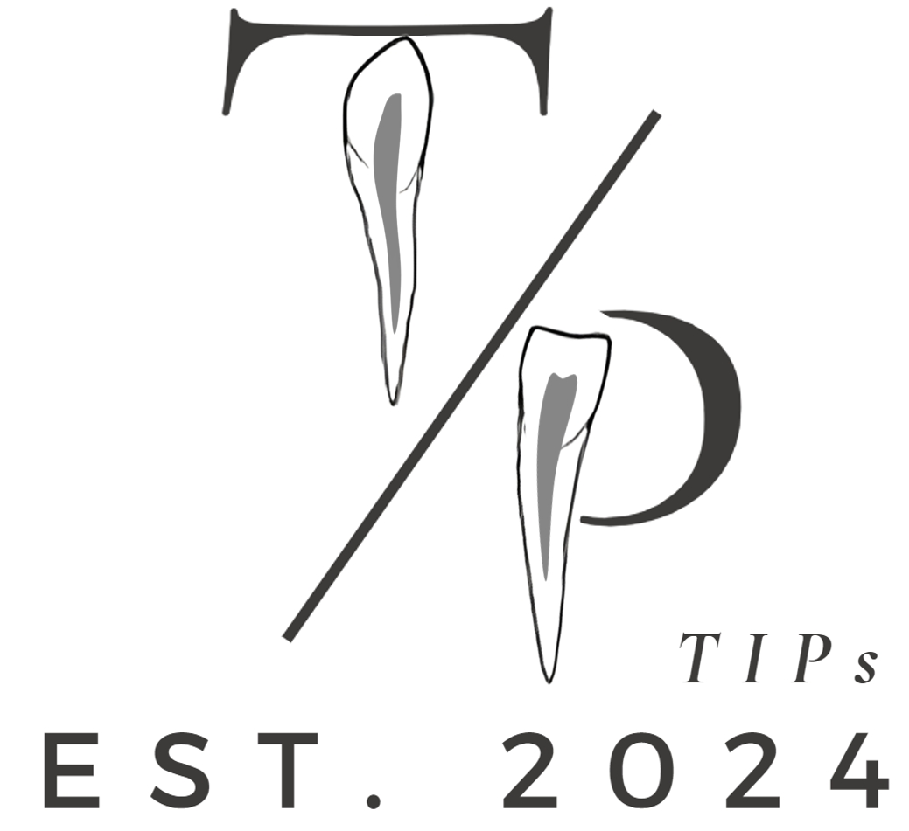

<div>

	

 
<strong>TIPs</strong>: 

An accurate and automated AI tool called TIPs for <b><u>T</u></b>ooth <b><u>I</u></b>nstances and <b><u>P</u></b>ulp <b><u>s</u></b>egmentation from CBCT.

</blockquote>
</div>
<br />


<br />
<br />

# Introduction
TIPs works out-of-the-box without requiring any retraining. By inputting a CBCT image, users can obtain both semantic and instance segmentation for teeth and pulps. The final instance labeling follows the FDI World Dental Federation notation.


# System requirement
Since this is a *Linux* based container, please install the container on a Linux system. The supported systems include but not limited to `Ubuntu`, `Debian`, `CentOS` and `Red Hat`. 

The pipeline is developed based on deep convolutional neural network techniques. A GPU (≥4GB) is required to support the processing. 

# Installation

Requirements: `Ubuntu 20.04`, `CUDA 11.8`

1. Create a virtual environment: `conda create -n tips python=3.10 -y` and `conda activate tips `
2. Install [Pytorch](https://pytorch.org/get-started/previous-versions/#linux-and-windows-4) 2.0.1: `pip install torch==2.0.1 torchvision==0.15.2 --index-url https://download.pytorch.org/whl/cu118`
3. Install [Mamba](https://github.com/state-spaces/mamba): `pip install causal-conv1d>=1.2.0` and `pip install mamba-ssm --no-cache-dir`
4. Download code: `git clone https://github.com/TaoZhong11/TIPs`
5. `cd TIPs` and run `pip install -e .`


sanity test: Enter python command-line interface and run

```bash
import torch
import mamba_ssm
```
# Model download
```bash
https://drive.google.com/file/d/1UuFgZ-kwRryPC-vK7w64xX0VO4iOAeGt/view?usp=drive_link
```

# Model path setting

```python
vi ~/.bashrc
export nnUNet_results = "/home/path/to/TIPs/nnResults"  # models_path
source ~/.bashrc
```

# Inference
```python
python   TIPs.py   folder_to_be_processed
```
# Paper

```
@article{TIPs,
    title={TIPs: Tooth Instances and Pulp segmentation based on hierarchical extraction and fusion of anatomical priors from cone-beam CT},
    author={Tao Zhong, Yang Ning, Xueyang Wu, Li Ye, Chichi Li, Yu Du, and Yu Zhang},
    journal={Submitted to JBHI},
    year={2024}
}
```

# Acknowledgments

We acknowledge all the authors of the employed public datasets, allowing the community to use these valuable resources for research purposes. We also thank the authors of [nnU-Net](https://github.com/MIC-DKFZ/nnUNet), [U-Mamba](https://github.com/bowang-lab/U-Mamba) and [Mamba](https://github.com/state-spaces/mamba) for making their valuable code publicly available.
